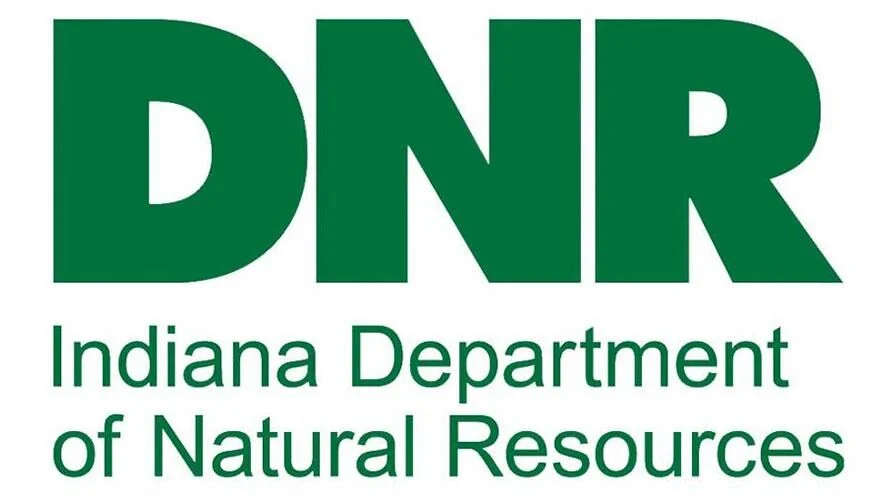
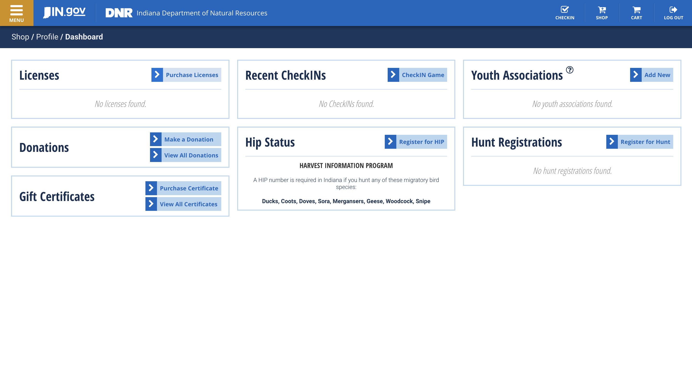

  


# Indiana Fishing License Online Purchase and Download Guide: A Tutorial
----------------

The author has no affiliation to the Indiana Department of Natural Resources. If you are considering Joshua Elms for employement, rest assured this guide is purely satire. If you are not considering him for employment, please follow the instructions below with strict attention to detail.


## Dependencies

You will need a recent web browser to follow along with this tutorial; Google Chrome is ideal. If you do not have Chrome, you can download it here after you crawl out from the rock under which you've been living: https://www.google.com/chrome/

You will also need an online payment method, such as a credit or debit card. 

Finally, you will need an identity; if your current identity is a bit too well-known to law enforcement, [this video](https://youtu.be/dQw4w9WgXcQ) has resources to help you find a new identity.


## Steps

1. Go to the DNR website here: https://secure.in.gov/apps/dnr/portal/home

2. Navigate to the card "Licenses for Hunting, Trapping & Fishing", and click the button labelled "Start Shopping"

3. If you have an account, press "Log In", enter your credentials, and skip to Step 6. Otherwise, press "Sign Up"

4. On "Access Indiana" popup that appears, press "Continue to Access Indiana"

5. If you have an Access Indiana account, enter your email information now. If not, that is unfortunate for you - I'm quite bored of writing these instructions, so I will leave this account's setup as an exercise for the reader

6. You should eventually end up on the page shown below. Press "Purchase Licenses"


7. Select the option "2023 Season Resident Annual Fishing", unless you are not a resident of Indiana. In this case, please return to wherever you came from and be glad it is not Indiana

8. Once you've added the permit to your cart, you should be placed on a page to purchase it. Press "Proceed to Checkout"

9. Enter your credit or debit card information into the form that appears. If you would like a safe and trusted third party to verify your details, you can send a screenshot of the completed form to the author of this repository

10. You will be given the choice to sign up as an organ donor; do so

11. Finally, the page you are left on should have a link to print or download a digital copy of your license. It is highly recommended that you download it, bookmark this dashboard to download it again in the future if needed, and print out a copy of your license for use while fishing - it is somewhat easier to replace a piece of paper than a laptop if you plan on dropping either into a body of water


Thank you for reading this guide! If you found it useful, you can cite it using the following information:

```
@article{elms2023dnrlicenseguide,
  title={Indiana Fishing License Online Purchase and Download Guide: A Tutorial},
  author={Elms, Josh},
  year={2023}
```
